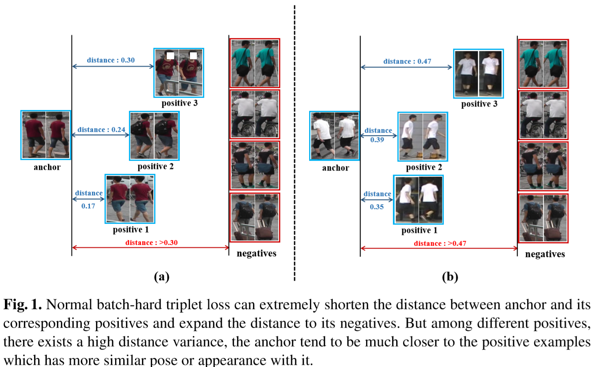
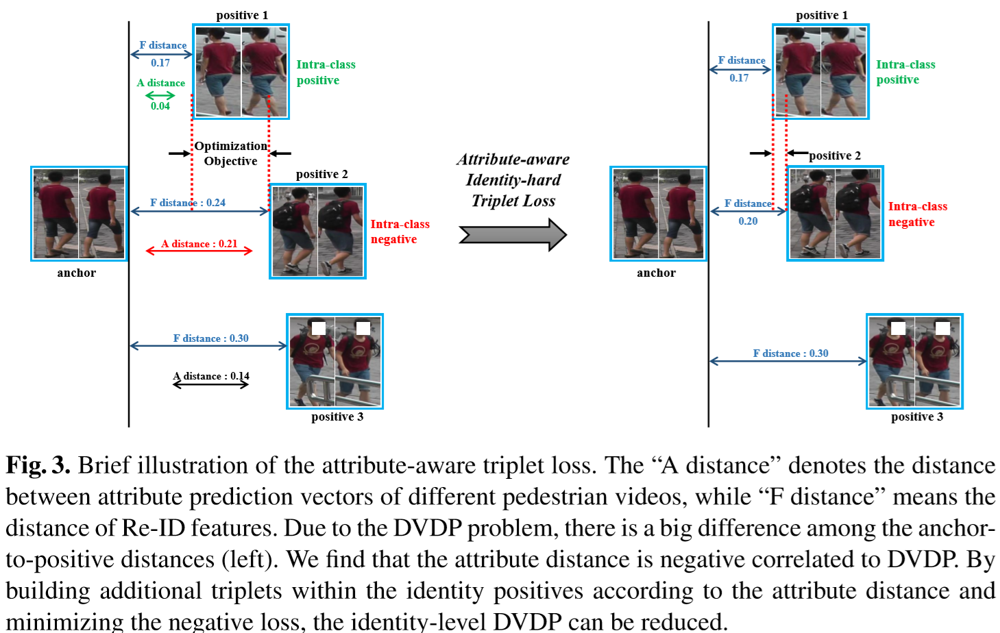
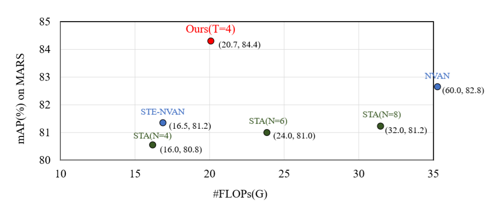

# Video-based-person-ReID-with-Attribute-information

This is the code repository for our paper "": https://arxiv.org/abs/.
If you find this help your research, please cite
    

### Introduction
This repository contains a project which firstly introducing the pedestrain attribute information into video-based Re-ID, we address this issue by introducing a new metric learning method called Attribute-aware Identity-hard Triplet Loss (AITL), which reduces the intra-class variation among positive samples via calculating attribute distance. To achieve a complete model of video-based person Re-ID, a multitask framework with Attribute-driven Spatio-Temporal Attention (ASTA) mechanism is also proposed. 
#### 1. Attribute-aware Identity-hard Triplet Loss 
The batch-hard triplet loss frequently used in video-based person Re-ID suffers from the Distanc eVariance among Different Positives(DVDP) problem.


Attribute-aware Identity-hard Triplet Loss to solve the DVDP.


#### 2. Attribute-driven Spatio-Temporal Attention 
Introducing the spatial-temporal attention in attribute recognition process into Re-ID process.


### Deployment
It is mainly forked from [video-person-reid](https://github.com/jiyanggao/Video-Person-ReID) and [reid-strong-baseline](https://github.com/michuanhaohao/reid-strong-baseline). Since I suffered from severe poverty, I introduce the [nvidia-apex](https://github.com/NVIDIA/apex) to train the model in FP16 settings, so the training codes can be directly ran on a single RTX2070s, which is very friendly to proletarians like me. 
If you owes a 32GB V100 Graphic Card or 2 * GTX 1080Ti Cards, you can just ignore the apex operation and run the codes on a single card, and increase the batch size to 128, the u can get a higher performance :).

Requirements:
```
pytorch >= 0.4.1 ( < 1.5.0 apex is not friendly to pytorch 1.5.0 according to my practice)
torchvision >= 0.2.1
tqdm
[nvidia-apex](https://github.com/NVIDIA/apex), please follow the detailed install instructions 
```


### Dataset
#### MARS
Experiments on MARS, as it is the largest dataset available to date for video-based person reID. Please follow [deep-person-reid](https://github.com/KaiyangZhou/deep-person-reid) to prepare the data. The instructions are copied here: 

1. Create a directory named `mars/`.
2. Download dataset to `mars/` from http://www.liangzheng.com.cn/Project/project_mars.html.
3. Extract `bbox_train.zip` and `bbox_test.zip`.
4. Download split information from https://github.com/liangzheng06/MARS-evaluation/tree/master/info and put `info/` in `data/mars` (we want to follow the standard split in [8]). The data structure would look like:
5. Download `mars_attributes.csv` from http://irip.buaa.edu.cn/mars_duke_attributes/index.html, and put the file in `data/mars`. The data structure would look like:
```
mars/
    bbox_test/
    bbox_train/
    info/
    mars_attributes.csv
```
6. Change the global variable `_C.DATASETS.ROOT_DIR` to `/path2mars/mars` and `_C.DATASETS.NAME` to `mars` in config or configs.

#### Duke-VID
1. Create a directory named `duke/` under `data/`.
2. Download dataset to `data/duke/` from http://vision.cs.duke.edu/DukeMTMC/data/misc/DukeMTMC-VideoReID.zip.
3. Extract `DukeMTMC-VideoReID.zip`.
4. Download `duke_attributes.csv` from http://irip.buaa.edu.cn/mars_duke_attributes/index.html, and put the file in `data/duke`. The data structure would look like:
```
duke/
    train/
    gallery/
    query/
    duke_attributes.csv
```
5. Change the global variable `_C.DATASETS.ROOT_DIR` to `/path2duke/duke` and `_C.DATASETS.NAME` to `duke` in config or configs.

### Usage
To train the model, please run

    python main_baseline.py
 
Please modifies the settings directly on the config files.   


### Performance


#### Comparision with SOTA

***The above performance is achieved in the setting: 2 * 1080Ti, train batchsize 128. (Once i was a middle-class deepnetwork-finetuner when i was in school.)***

**Best performance on MARS(1 * RTX 2070s, train batchsize 64)**: (Now i'm a proletarian. 要为了真理而斗争！)

mAP : 82.5%  Rank-1 : 86.5%

#### Better trade-off between speed and performance:


More experiments result can be found in paper.